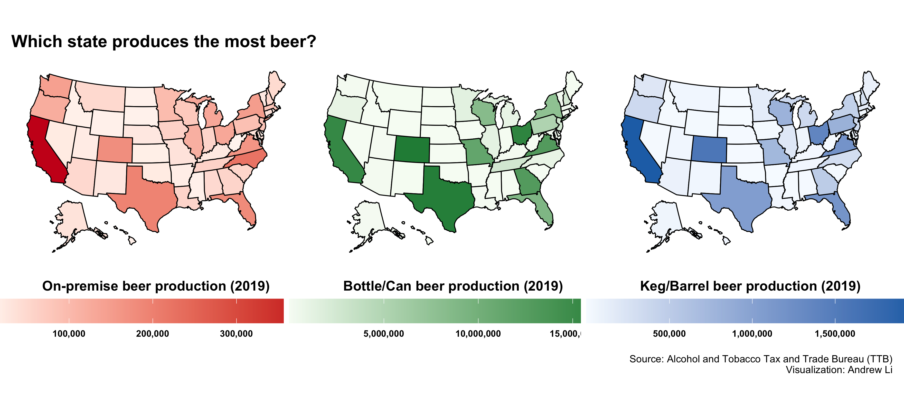
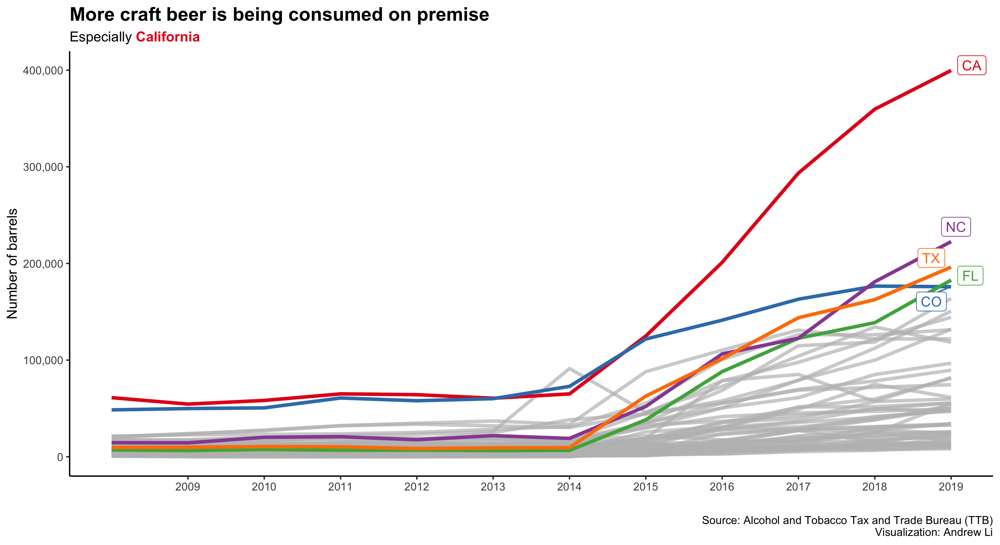
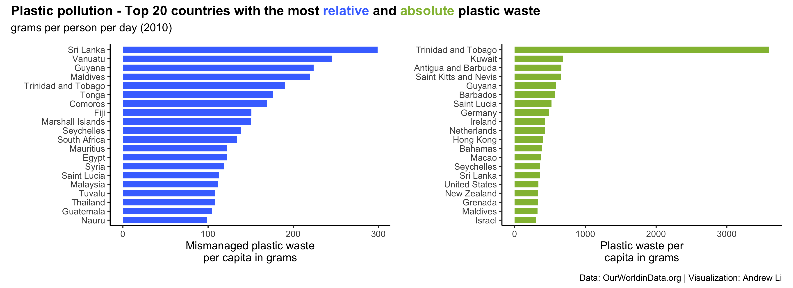

Andrew’s TidyTuesday
================

Source: [R4DS](https://r4ds.had.co.nz/introduction.html)

### Motivation

This repo houses my submissions to the weekly
[\#TidyTuesday](https://github.com/rfordatascience/tidytuesday) data
project. Using R and modern tools such as `{ggplot2}`, `{dplyr}`,
`{tidyr}`, and other tools in the
[`tidyverse`](https://www.tidyverse.org) package, I hope to improve my
data wrangling and visualization skills. As well, this a great outlet
for me to experiment and go crazy as graphs for manuscripts are much
more conservative. Furthermore, I hope to document my improvements!

### [Beer Production](https://github.com/rfordatascience/tidytuesday/blob/master/data/2020/2020-03-31/readme.md)

### [Global Plastic Waste](https://github.com/rfordatascience/tidytuesday/tree/master/data/2019/2019-05-21)

### [Traumatic Brain Injury](https://github.com/rfordatascience/tidytuesday/blob/master/data/2020/2020-03-24/readme.md)

### [Vancouver trees](https://github.com/andr3wli/tidytuesday/tree/main/trees)

### Acknowledgement

I will acknowledge specific people/repos that I used for inspiration but
I will be greatly looking at my friend and collaborator [Georgios
Karamanis](https://github.com/gkaramanis) for inspiration. This project
was founded in 2018 by [Thomas Mock](https://thomasmock.netlify.app) and
organized by [R4DS (“R 4 Data Science”) online learning
community](https://twitter.com/r4dscommunity).
