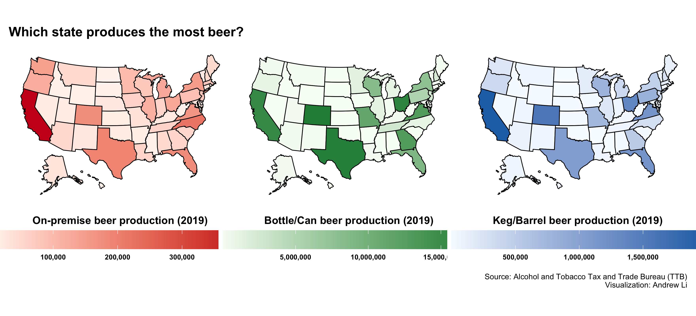
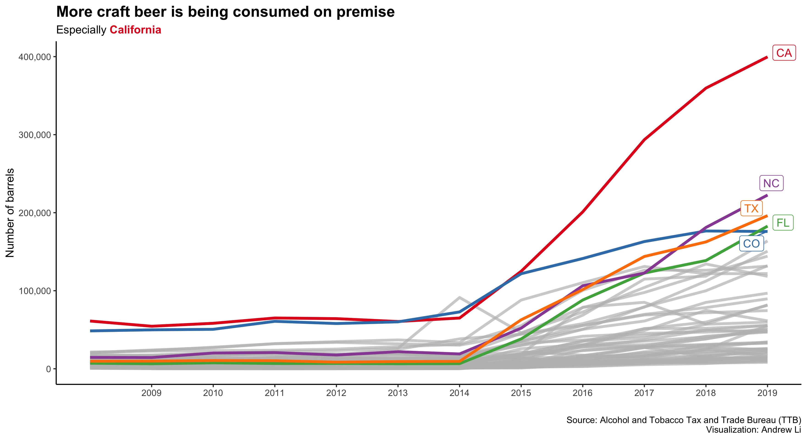

Beer Production
================

[Andrew Li](https://github.com/andr3wli)

### Data

This week’s
[\#TidyTuesday](https://github.com/rfordatascience/tidytuesday)
challenge looks at beer production. You can find the repo
[here](https://github.com/rfordatascience/tidytuesday/blob/master/data/2020/2020-03-31/readme.md).
I used the `beer_state.csv` data set.

``` r
beer_states <- readr::read_csv('https://raw.githubusercontent.com/rfordatascience/tidytuesday/master/data/2020/2020-03-31/beer_states.csv')
```

### Plots



### Plots


