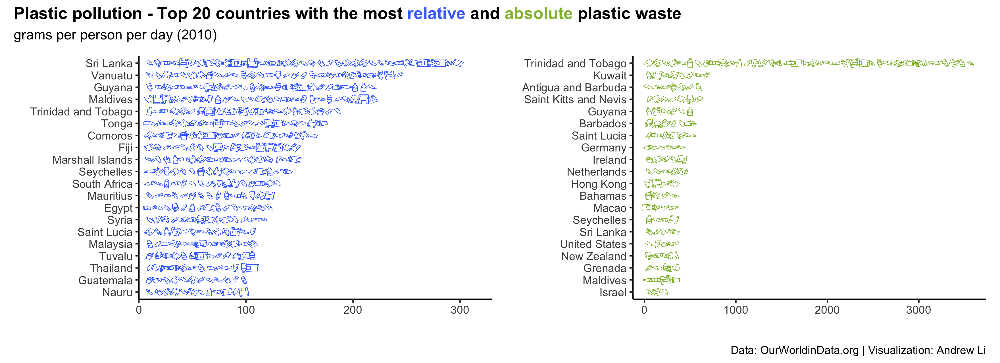

Global Plastic Waste
================

[Andrew Li](https://github.com/andr3wli)

### Data

This week’s
[\#TidyTuesday](https://github.com/rfordatascience/tidytuesday)
challenge looks at plastic pollution. You can find the repo
[here](https://github.com/rfordatascience/tidytuesday/tree/master/data/2019/2019-05-21).
I used the `mismanaged_vs_gdp.csv` and `waste_cs_gdp.csv` data sets.

``` r
mismanaged_vs_gdp <- readr::read_csv("https://raw.githubusercontent.com/rfordatascience/tidytuesday/master/data/2019/2019-05-21/per-capita-mismanaged-plastic-waste-vs-gdp-per-capita.csv")

waste_vs_gdp <- readr::read_csv("https://raw.githubusercontent.com/rfordatascience/tidytuesday/master/data/2019/2019-05-21/per-capita-plastic-waste-vs-gdp-per-capita.csv")
```

### Plots


### Plots



### Acknowledgement

Thank to my friend and collaborator [Georgios
Karamanis](https://karaman.is) for the help and inspiration. I used his
code and cool idea to use the small images in the bar graph.
