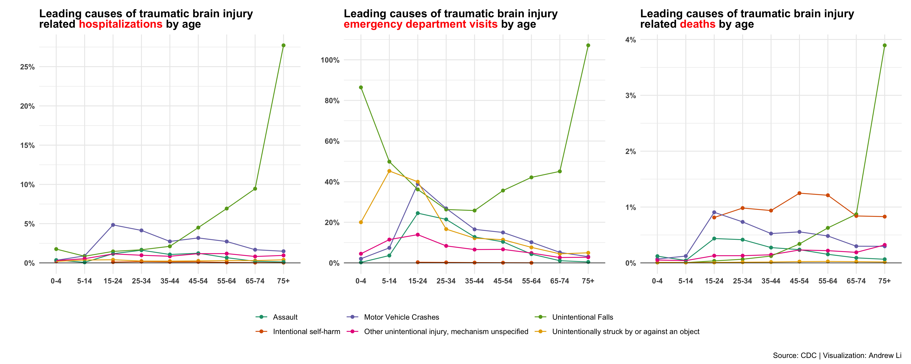

```{r setup, include=FALSE}
knitr::opts_chunk$set(echo = TRUE)
```
[Andrew Li](https://github.com/andr3wli)

**NOTE:** I created this plot for expository purposes. This plot was used to teach data wrangling and visualization for the Nueroscience Undergraduate Research Conference [LearnR workshop](https://andrewli-learnr.netlify.app). 

### Data
This week's [#TidyTuesday](https://github.com/rfordatascience/tidytuesday) challenge looks at traumatic brain injury. You can find the repo [here](https://github.com/rfordatascience/tidytuesday/blob/master/data/2020/2020-03-24/readme.md). I used the `tbi_age.csv` data set.

```{r, eval=FALSE}
tbi_age <- readr::read_csv('https://raw.githubusercontent.com/rfordatascience/tidytuesday/master/data/2020/2020-03-24/tbi_age.csv')
```

### Plots
```{r, fig.margin = TRUE, echo = FALSE, out.width = "100%", fig.align='center'}

```

### Acknowledgement
I was inspired by [Tom Mock's](https://thomasmock.netlify.app) plot!