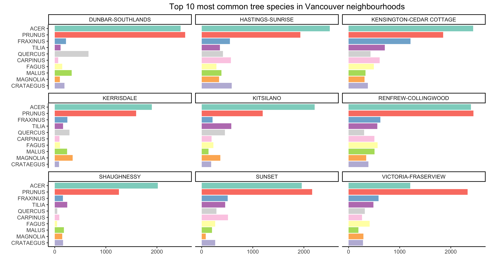

Vancouver Trees
================

[Andrew Li](https://github.com/andr3wli)

### Data

This data set comes from the R data package
[datateachr](https://github.com/UBC-MDS/datateachr). Specifically, I
used the `vancouver_trees` data set. This isn’t from TidyTuesday.

```
# Install the R data package
devtools::install_github("UBC-MDS/datateachr")
```

``` r
library(datateachr)
head(vancouver_trees)
```

    ##   tree_id civic_number std_street genus_name species_name   cultivar_name
    ## 1  149556          494  W 58TH AV      ULMUS    AMERICANA         BRANDON
    ## 2  149563          450  W 58TH AV    ZELKOVA      SERRATA            <NA>
    ## 3  149579         4994 WINDSOR ST     STYRAX     JAPONICA            <NA>
    ## 4  149590          858  E 39TH AV   FRAXINUS    AMERICANA AUTUMN APPLAUSE
    ## 5  149604         5032 WINDSOR ST       ACER    CAMPESTRE            <NA>
    ## 6  149616          585  W 61ST AV      PYRUS   CALLERYANA     CHANTICLEER
    ##           common_name assigned root_barrier plant_area on_street_block
    ## 1         BRANDON ELM        N            N          N             400
    ## 2    JAPANESE ZELKOVA        N            N          N             400
    ## 3   JAPANESE SNOWBELL        N            N          4            4900
    ## 4 AUTUMN APPLAUSE ASH        Y            N          4             800
    ## 5         HEDGE MAPLE        N            N          4            5000
    ## 6    CHANTICLEER PEAR        N            N          B             500
    ##    on_street       neighbourhood_name street_side_name height_range_id diameter
    ## 1  W 58TH AV                  MARPOLE             EVEN               2       10
    ## 2  W 58TH AV                  MARPOLE             EVEN               4       10
    ## 3 WINDSOR ST KENSINGTON-CEDAR COTTAGE             EVEN               3        4
    ## 4  E 39TH AV KENSINGTON-CEDAR COTTAGE             EVEN               4       18
    ## 5 WINDSOR ST KENSINGTON-CEDAR COTTAGE             EVEN               2        9
    ## 6  W 61ST AV                  MARPOLE              ODD               2        5
    ##   curb date_planted longitude latitude
    ## 1    N   1999-01-13 -123.1161 49.21776
    ## 2    N   1996-05-31 -123.1147 49.21776
    ## 3    Y   1993-11-22 -123.0846 49.23938
    ## 4    Y   1996-04-29 -123.0870 49.23469
    ## 5    Y   1993-12-17 -123.0846 49.23894
    ## 6    Y         <NA> -123.1196 49.21513

### Plots


### Facet wrap



### Points


