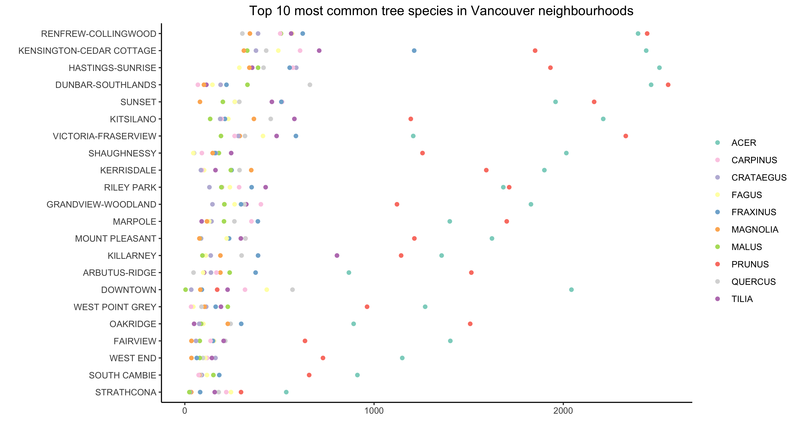

Vancouver Trees
================

## Data

This data set comes from the R data package
[datateachr](https://github.com/UBC-MDS/datateachr). Specifically, I
used the `vancouver_trees` data set. This isn’t from TidyTuesday.

## Plots

## Facet wrap

## Points

